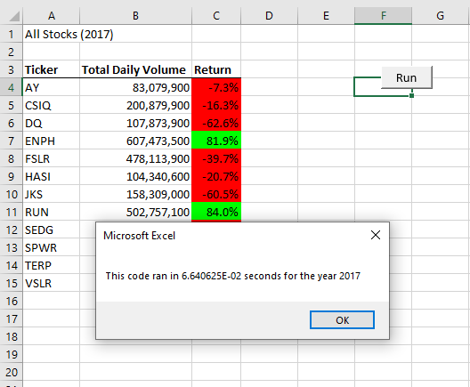
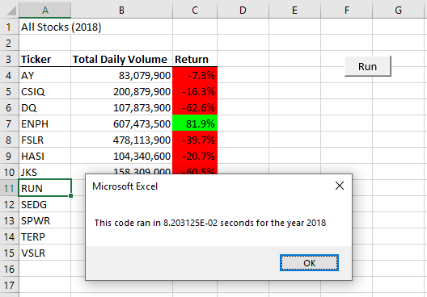

# stock-analysis

## Overview of Project

### Purpose :

After evaluating specific green stocks, Steve wants to expand the dataset of the VBA analysis to include the entire stock market over the last few years. By **refactoring** the code we made during the module 2 assignment we can loop through all the data one time in order to collect the same information.

### Results :

Created a macro named AllStocksAnalysisRefactored. In this script we created arrays for stock ticker volumes as well as their starting and ending prices  so that we could ultimately calculate the return for the 12 stocks we indexed. 

###### **_All Stocks 2017_**

###### **_All Stocks 2018_**

The stocks that had the highest return were: 
- ENPH : Return- 81.9%
- RUN : Return-84%

The script of AllStocksAnlysis had an ***original run time of 0.5468 seconds.*** After refactoring the worksheet with the code for ***AllStockAnalysisRefactored had run times of 0.06 & 0.08 seconds respectively.***

### Summary :

By refactoring you are not adding or eliminating any functionality to your code but rather making it run more eficciently. This gives us the ability to improve on the design and structure of an original code. 

In this challenge we learned that refactoring code is a key part of the process. By making the code run more efficiently we ere able to appreciate a marked reduction in run time of approximately 85%! 

*original: 0.5 sec, refactored: 0.07 sec/ average run times of the two sheets.*